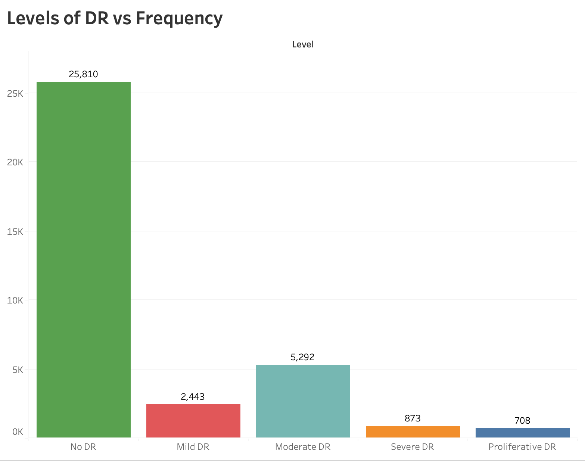

\newpage

**Declaration of Originality**

I declare that this project is all my own work and has not been copied in part or in whole from any other source except where duly acknowledged. As such, all use of previously published work (from books, journals, magazines, internet etc.) has been acknowledged by citation within the main report to an item in the References or Bibliography lists. I also agree that an electronic copy of this project may be stored and used for the purposes of plagiarism prevention and detection.

**Statement of copyright**

I acknowledge that the copyright of this project report, and any product developed as part of the project, belong to Coventry University. Support, including funding, is available to commercialise products and services developed by staff and students. Any revenue that is generated is split with the inventor/s of the product or service. For further information please see [www.coventry.ac.uk/ipr](http://www.coventry.ac.uk/ipr) or contact [ipr\@coventry.ac.uk](mailto:ipr@coventry.ac.uk){.email}.

**Statement of ethical engagement**

I declare that a proposal for this project has been submitted to the Coventry University ethics monitoring website (<https://ethics.coventry.ac.uk/>) and that the application number is listed below (Note: Projects without an ethical application number will be rejected for marking)

\[Signed:\]{AleenaAlby} [Date:]{.ul}

Please complete all fields.

| First Name: Aleena                      |
|:----------------------------------------|
| Last Name: Alby                         |
| Student ID number                       |
| Ethics Application Number               |
| 1^st^ Supervisor Name Prof James Brusey |
| 2^nd^ Supervisor Name                   |

```{=html}
<!--  **This form must be completed, scanned and included with your project
submission to Turnitin. Failure to append these declarations may result
in your project being rejected for marking.** -->
```
```{=tex}
\pagebreak
\tableofcontents
\pagebreak
```
# Abstract

# Introduction

One of the major causes of eye vision loss is diabetes. While delayed examination would have a higher effect on the retinal area of the eye, early detection of diabetes is crucial. ## Background to the Project

## Project Objectives

## Overview of This Report

# Literature Review

A model to identify diabetic retinopathy at an earlier stage has been developed by a number of researchers.

\pagebreak

# Methodology

### *Dataset*

For this research project I'm using dataset available at Kaggle[@diabetica_data]. This Retinal images were provided by EyePACS. The dataset containing large set of high-resolution retina images taken under a variety of imaging conditions. For each image, a left and right field is provided. Images are identified by a image id and either the left or right eye (for example, 1 left.jpeg represents the patient number 1's left eye).

| DR classes    | Level | Description                                                                                                                       |
|---------------|-------|-----------------------------------------------------------------------------------------------------------------------------------|
| No DR         | 0     | Healthy Retina (Normal)                                                                                                           |
| Mild          | 1     | Retina with tiny bulges (microaneurysms)                                                                                          |
| Moderate      | 2     | Retina with microaneurysms, higher risk of developing vision problems in the future                                               |
| Severe        | 3     | Retina with severe and widespread microaneurysms, including bleeding into the retina                                              |
| Proliferative | 4     | New blood vessels and scar tissue have formed on your retina, which can cause significant bleeding and lead to retinal detachment |

: [@diabetic2017]

![Normal Retina Vs Diabetic Retinopathy Retina [@diabetica]](images/image%201.jpg "Normal Retina Vs Diabetic retinopathy Retina [@diabetica]"){width="400" height="300"}

### *Data pre-processing*

Image pre-processing was performed with the aim to decrease unclear image and reduce image size. The plot below illustrates the class imbalance in the original dataset.

{width="343"}

The dataset consist of 35,126 set of images. The orginal image have 1944 \* 2592 \* 3 size, and all images are jpeg format. The classes have an uneven distribution of images.

\pagebreak

1.  Image Resizing

    Due to the enormous size of the dataset, it was drastically downsized before being sent to the network. Each input image is 256 \* 256 in size after resizing.

2.  Removing Unclear Image

    Some images have a blackish or white tint. Because it might affect the outcome, this type of image cannot be fed into the network. The removal of an unclear image is a crucial step that must be taken.

3.  Dividing images into classes

    Images are classified into 5 folders based on the DR levels.

\pagebreak

# Requirements

# Analysis

# Design

# Implementation

# Testing

# Project Management

## Project Schedule

## Risk Management

## Quality Management

## Social, Legal, Ethical and Professional Considerations

# Critical Appraisal

# Conclusions

## Achievements

## Future Work

# Student Reflections

# References

::: {#refs}
:::

Appendix A -- Project Specification

Appendix B -- Interim Progress Report and Meeting Records

Appendix C -- Requirements Specification Document

Appendix D -- User Manual

Appendix E -- Project Presentation

Appendix F -- Certificate of Ethics Approval
